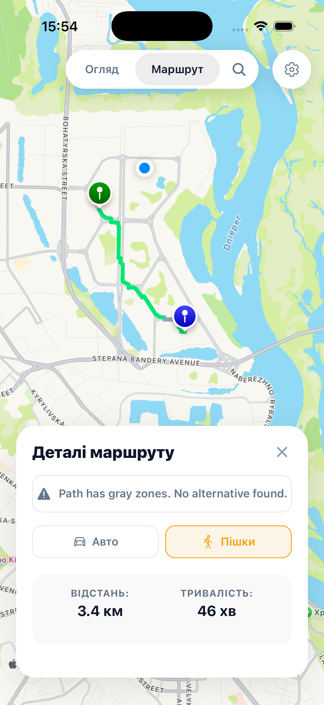
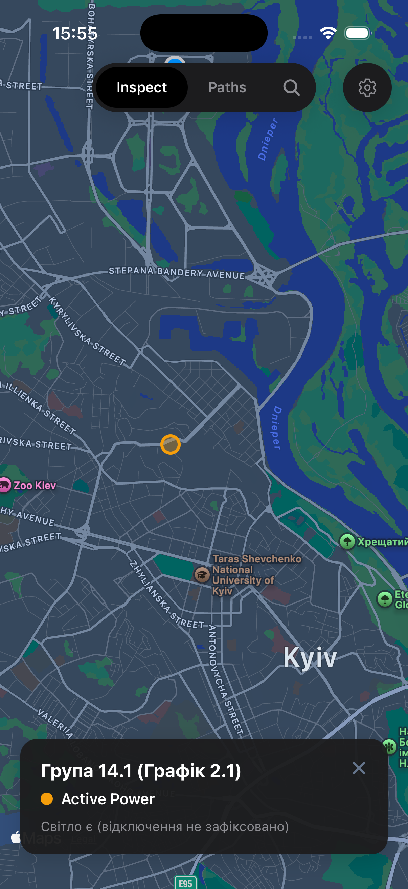
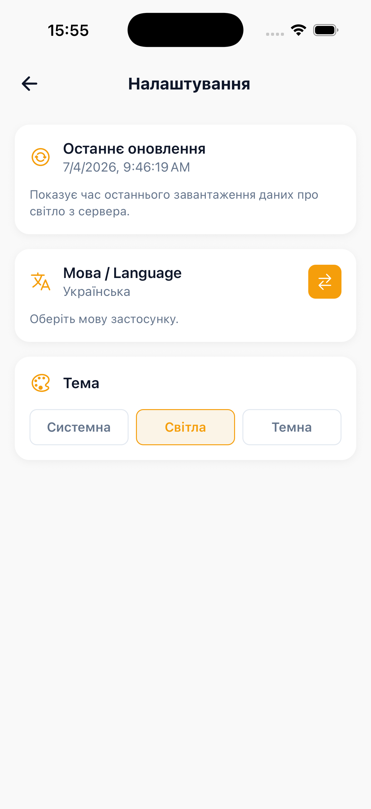

# Svitliachok

A React Native mobile application for navigating Kyiv safely during power outages, choosing illuminated paths, and saving custom locations.

## Screenshots

| Inspect & Safe Paths | Saved Locations | Search & Settings |
| :---: | :---: | :---: |
|  |  |  |

## Features

- **Safe Routing**: Calculates illuminated walking or driving routes using custom street lamp data.
- **Inspect Mode**: Tap anywhere on the map to see real-time blackout status.
- **Saved Locations**: Add, label, and manage home, school, business, and other custom spots.
- **Theme Support**: Adaptive styling for both light and dark modes.
